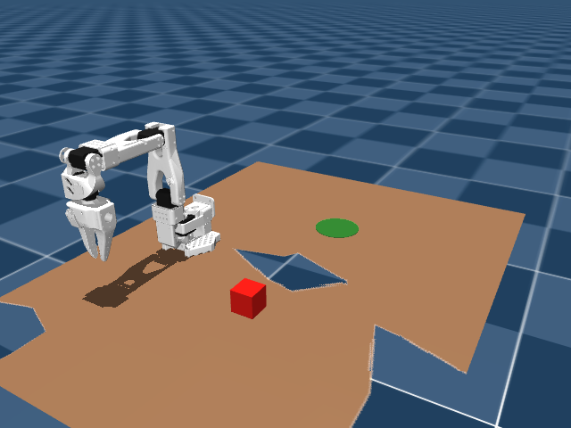

# sim_mujoco — SO-100 MuJoCo environment (Mac-runnable)

Native MuJoCo environment for the SO-100 arm, built because Isaac Sim can't run on a Mac and
MuGS (the environment-reconstruction approach we want to use) targets MuJoCo specifically. This
runs on CPU on the MacBook Air today; the same scene/model works unchanged if we later move to
Newton (GPU MuJoCo backend) on the RTX 2070 Super box.



## Status

- [x] SO-100 arm model loads, steps, holds pose under gravity (vendored from
      [MuJoCo Menagerie](https://github.com/google-deepmind/mujoco_menagerie)'s `trs_so_arm100`)
- [x] Table + graspable cube + target zone scene, physics-stable
- [x] Minimal Python env wrapper (`envs/so100_pick_place.py`) with reset/step/observation
- [ ] robosuite `RobotModel`/gripper class wrapper (so LIBERO's task scaffolding, controllers,
      and renderer can drive this robot the same way it drives Panda) — **not done yet**
- [ ] Camera matching the planned phone-video fixed viewpoint
- [ ] Workspace dimensions matched to measured real tabletop (cube/target positions below are
      placeholders, not measured)

## Layout

```text
sim_mujoco/
  assets/so100/
    so_arm100.xml          # vendored, unmodified MJCF from MuJoCo Menagerie
    assets/*.stl           # robot meshes
    scene_pick_place.xml   # our scene: so_arm100 + table + cube + target zone + camera
    LICENSE, UPSTREAM_README.md   # menagerie's original license/readme (Apache-2.0, see file)
  envs/
    so100_pick_place.py    # SO100PickPlaceEnv: reset()/step(action)/_get_obs()
  smoke_test.py             # loads the scene, steps it, prints state — sanity check
  requirements.txt
```

## Why MuJoCo over Isaac Lab for this piece

The `sim/` directory (Isaac Lab) at the repo root has more mature tooling (domain randomization,
LeRobot dataset recording, tuned SO-100 physics) but **cannot run on this Mac** — Isaac Sim has no
macOS build. This `sim_mujoco/` directory is the Mac-native path, and lines up with using LIBERO
(built on robosuite/MuJoCo) and MuGS (built on MuJoCo) for the reviewer-facing benchmark story.

## Running

```bash
cd /Users/hassaan/Projects/HumanoidLondon
source .venv/bin/activate   # created via: python3.11 -m venv .venv && pip install -r sim_mujoco/requirements.txt
python sim_mujoco/smoke_test.py
```

Joint order for `env.step(action)`: `Rotation, Pitch, Elbow, Wrist_Pitch, Wrist_Roll, Jaw`
(matches the actuator/joint names in the vendored MJCF — note these differ from the Isaac Lab
asset's naming, which used `shoulder_pan` / `shoulder_lift` / `elbow_flex` / etc. for the same
physical joints).

## Next steps

1. Wrap `assets/so100/so_arm100.xml` as a robosuite `RobotModel` (+ gripper class for the Jaw) so
   it can be registered and driven inside robosuite/LIBERO's task and controller framework.
2. Replace the placeholder cube/target positions with your actual measured tabletop dimensions.
3. Add the gripper-mounted + external camera views (same two-camera pattern as the Isaac Lab
   setup) so sim rollouts produce the same observation shape as the real phone-video pipeline.
4. Hook in MuGS for the environment background once the task geometry is finalized.
